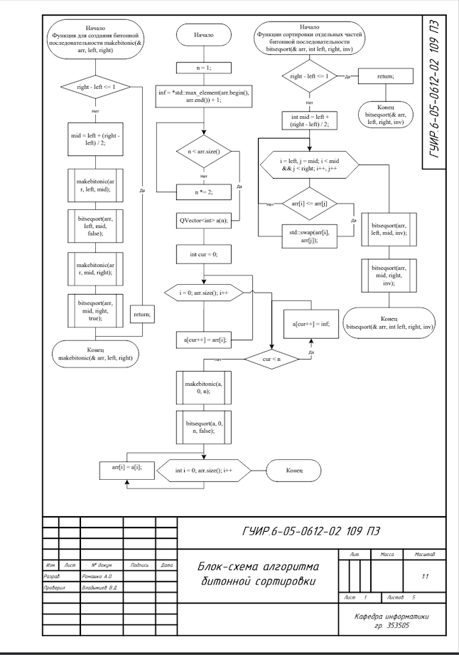
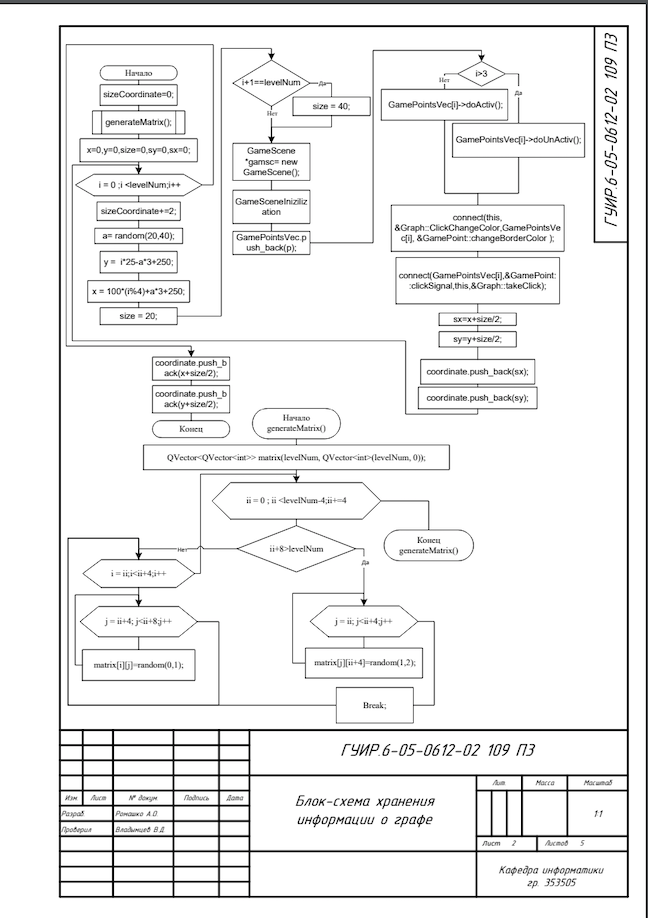
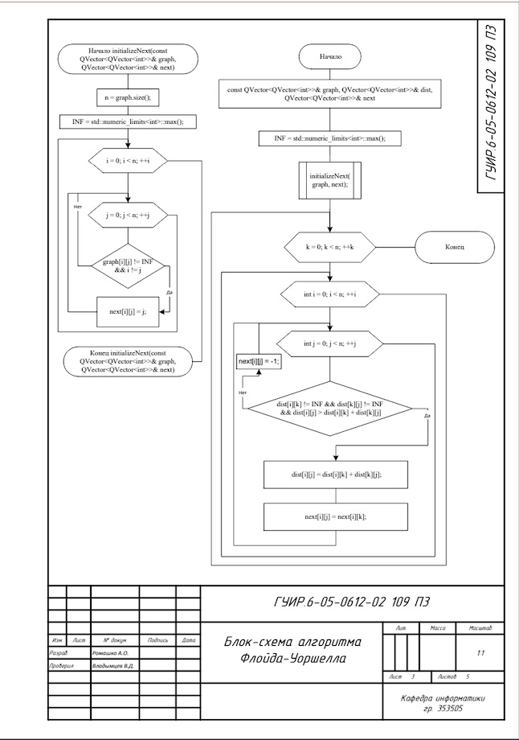
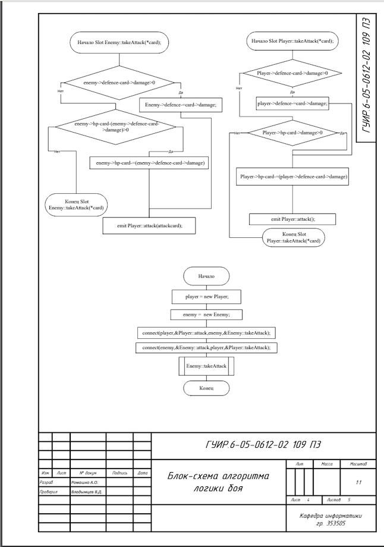
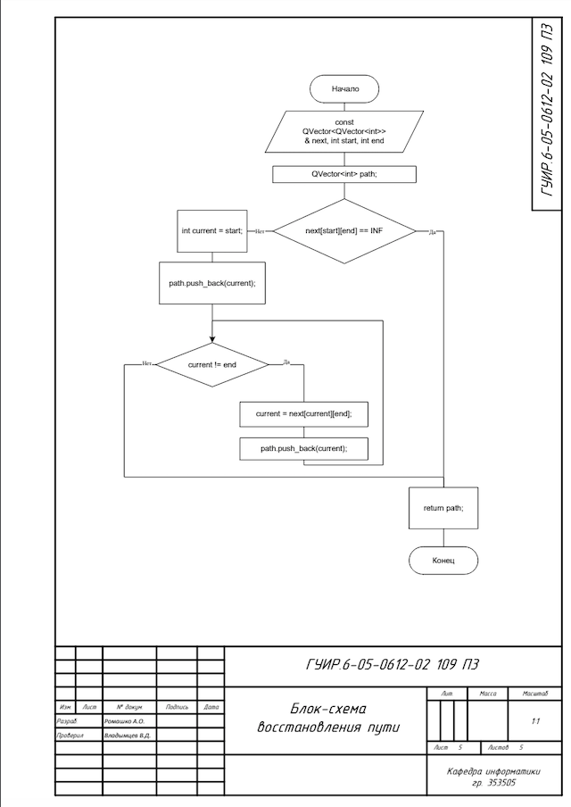

#Разработка приложения аналога игры   STS

Данный курсовой проект представляет из себя аналог игры STS, позволяющее играть с компьютером.

##Блок-схема алгоритма, реализующего битонную сортировку

Применяется в: `DialogShowCards.cpp`, в методе `getPlayerAndDeck`, реализована в файле `bittonsort.cpp`

Применяется в: ` GamelevelScene.cpp`, в его конструкторе, реализована в файле `graph.cpp`, в его конструкторе 

Применяется в: `graph.cpp`, в методе `addLineToScene`, реализована в файле `UFloid.cpp`

Применяется в: `GameSceneView.cpp`, в методе `GenerateEnemy`, реализованна в файлах `player.cpp` & `enemy.cpp`

Применяется в: `graph.cpp`, в методе `addLineToScene`, реализованна в файле `UFloid.cpp`, в методе `getPath`

