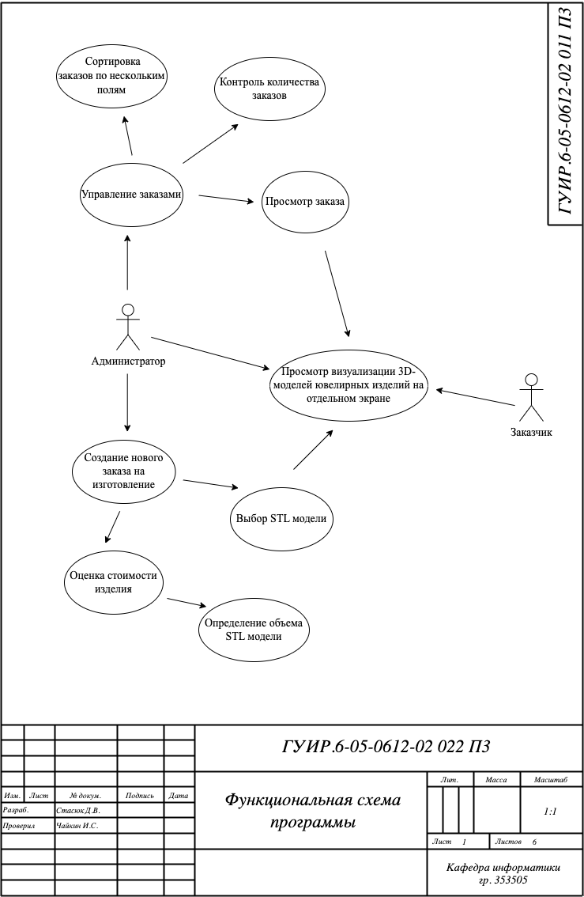
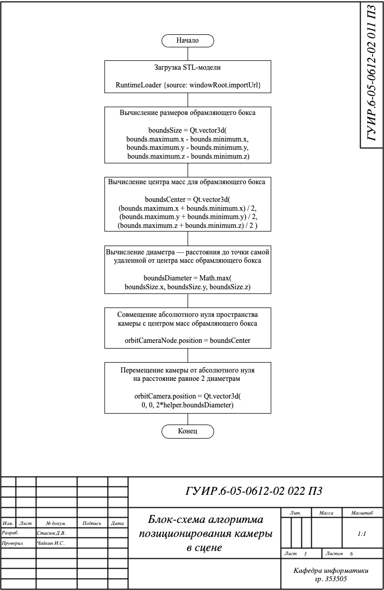
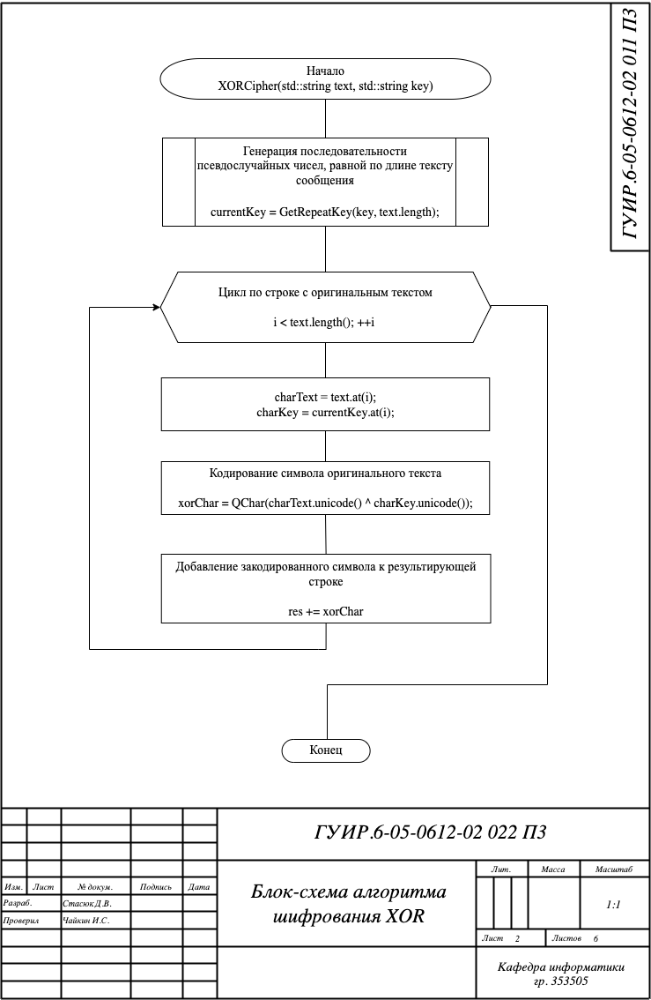
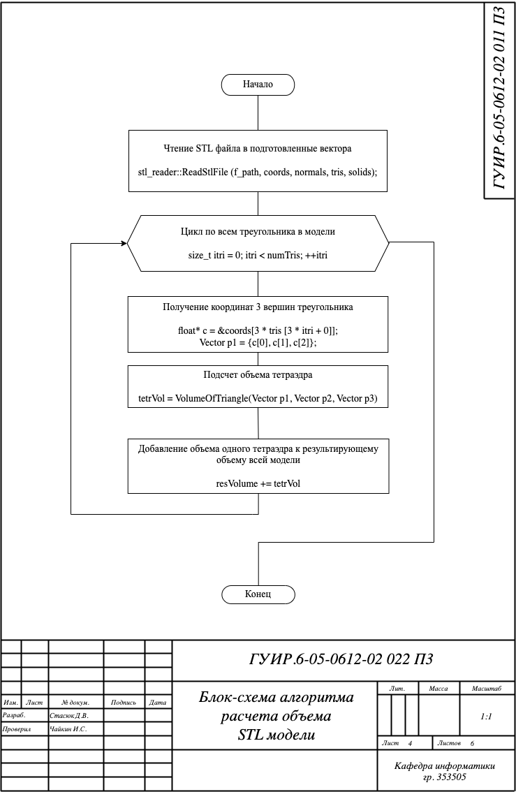
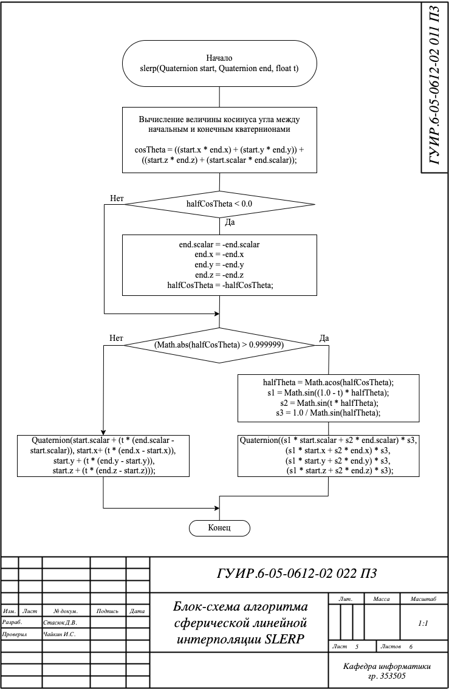
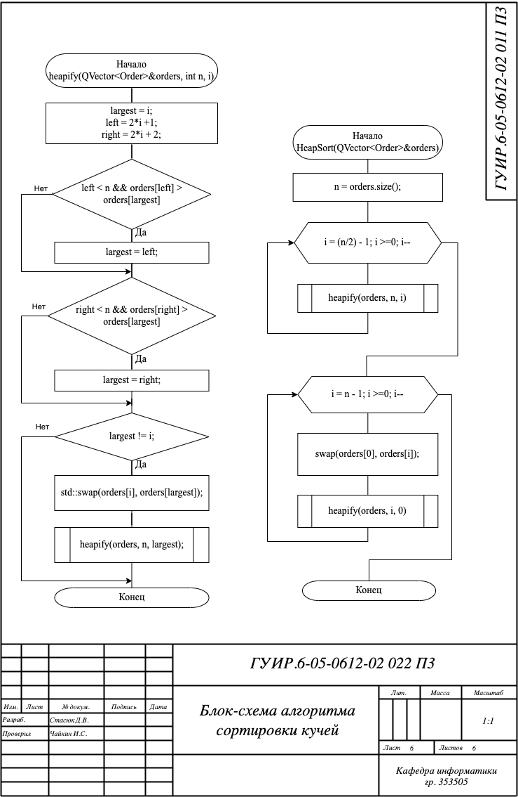

# Функциональная схема программы

# Блок-схема алгоритма позиционирования камеры в сцене
Применяется в: 353505/Стасюк Д.В./Курсовая работа/mainQuat.qml в методе updateBounds(bounds), результат работы обрабатывается в методе resetController().

# Блок-схема алгоритма шифрования XOR
Применяется в: 353505/Стасюк Д.В./Курсовая работа/xor_crypt.cpp в методе xor_crypt(std::string key, std::string data), результат работы обрабатывается в методах load_from_file(QString file_path) и save_to_file(QString file_path).

# Блок-схема алгоритма расчета объема STL модели
Применяется в: 353505/Стасюк Д.В./Курсовая работа/volume.cpp в методе getVolumeStl(std::string f_path), результат работы обрабатывается в методе-обработчике выбора STL-модели.

# Блок-схема алгоритма сферической линейной интерполяции SLERP
Применяется в: 353505/Стасюк Д.В./Курсовая работа/mainQuat.qml в методе slerp(start, end, t), результат работы обрабатывается в свойстве позиционирования камеры.

# Блок-схема алгоритма сортировки кучей
Применяется в: 353505/Стасюк Д.В./Курсовая работа/heapsort.cpp в методе heapSort(std::vector<Order> &arr, std::string field), результат работы обрабатывается в функции отображения данных.

