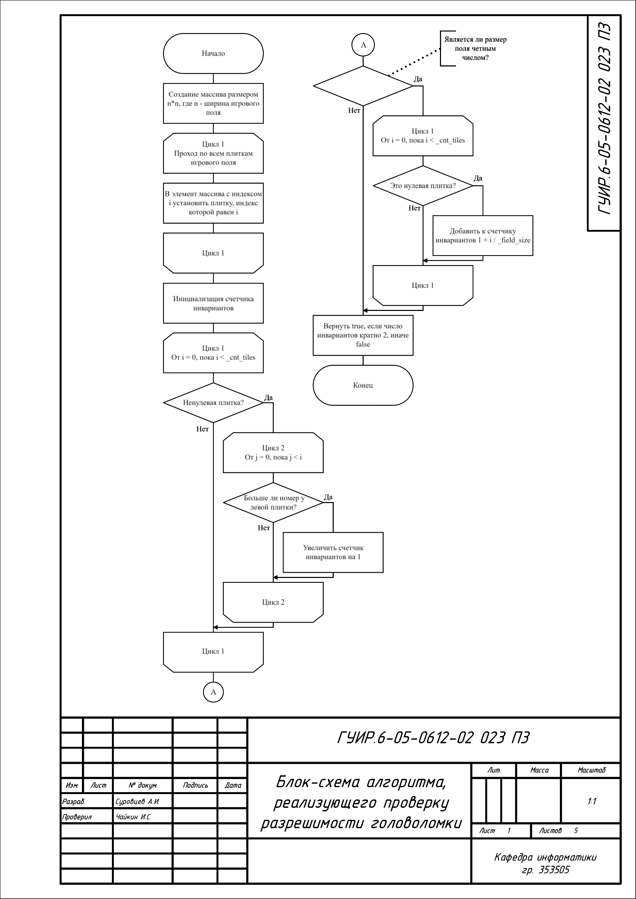
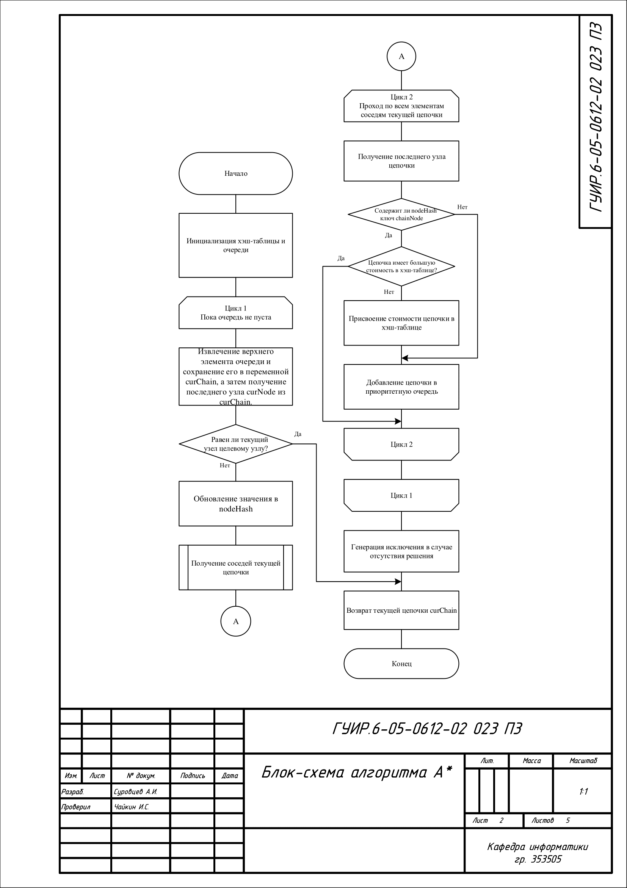
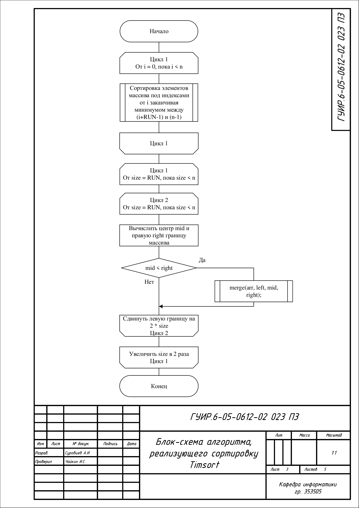
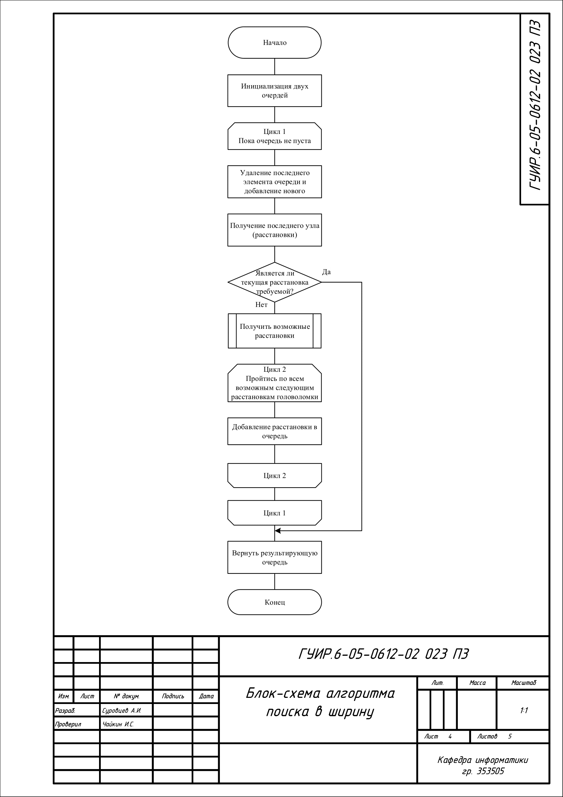
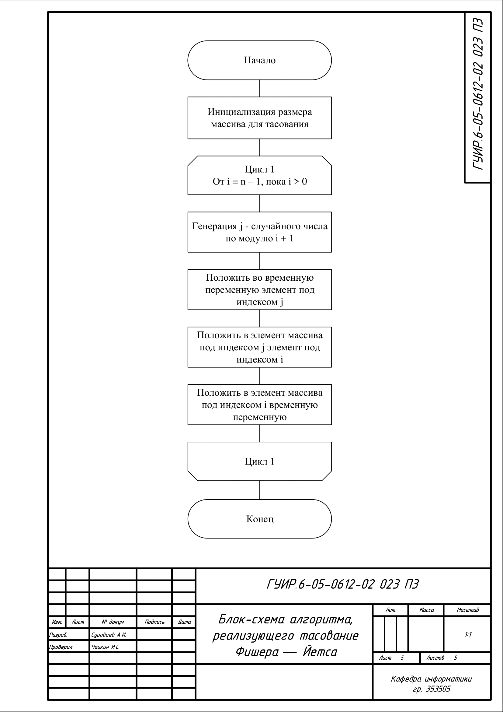

## Блок-схема алгоритма, реализующего проверку разрешимости головоломки

Применяется в: `Fundamentals-of-algorithmization-and-programming/353505/Суровцев А.И./Курсовая работа/CourseWork/15-puzzle/puzzleview.cpp` в методе bool PuzzleView::isSolvable(), результат работы обрабатывается в методе void PuzzleView::genInit()

## Блок-схема алгоритма A*

Применяется в: `Fundamentals-of-algorithmization-and-programming/353505/Суровцев А.И./Курсовая работа/CourseWork/15-puzzle/puzzlesolver.cpp` в методе Chain15 PuzzleSolver::a_star(const Chain15 &startChain, const QString &goalNode), результат работы обрабатывается в методе void PuzzleSolver::solvePuzzle(const Chain15 &start, const QString &goalNode)

## Блок-схема алгоритма, реализующего сортировку Timsort

Применяется в: `Fundamentals-of-algorithmization-and-programming/353505/Суровцев А.И./Курсовая работа/CourseWork/15-puzzle/timsort.cpp` в методе void TimSort::timSort(QVector<long long> &arr, long long n), результат работы обрабатывается в методе void PuzzleView::showBestResults()

## Блок-схема алгоритма поиска в ширину

Применяется в: `Fundamentals-of-algorithmization-and-programming/353505/Суровцев А.И./Курсовая работа/CourseWork/15-puzzle/chain15.cpp` в методе QVector<Chain15> Chain15::getNeighbours(), результат работы обрабатывается в методе Chain15 PuzzleSolver::a_star(const Chain15 &startChain, const QString &goalNode)

## Блок-схема алгоритма, реализующего тасование Фишера-Йетса

Применяется в: `Fundamentals-of-algorithmization-and-programming/353505/Суровцев А.И./Курсовая работа/CourseWork/15-puzzle/puzzleview.cpp` в методе void PuzzleView::fisherYatesShuffle(QVector<int> &array), результат работы обрабатывается в методе void PuzzleView::shuffleTiles()

